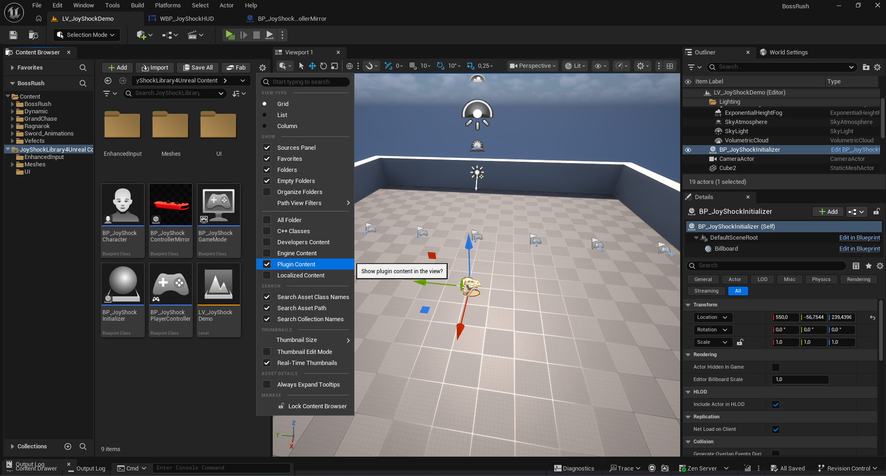
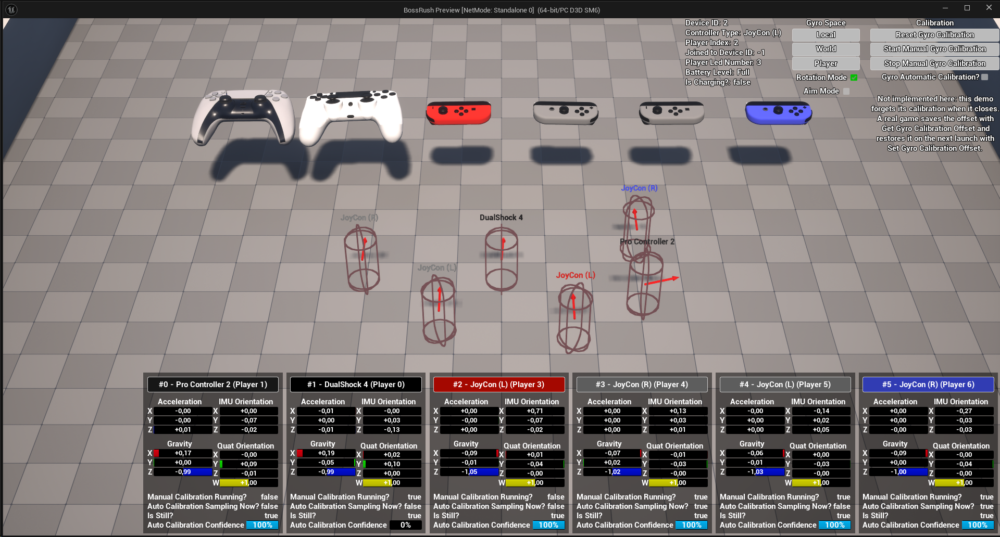
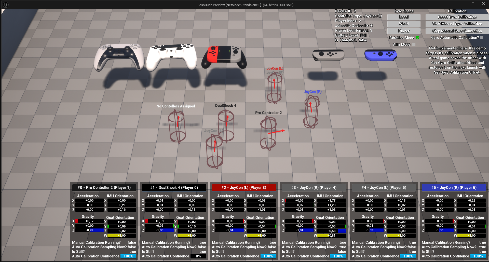
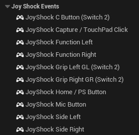
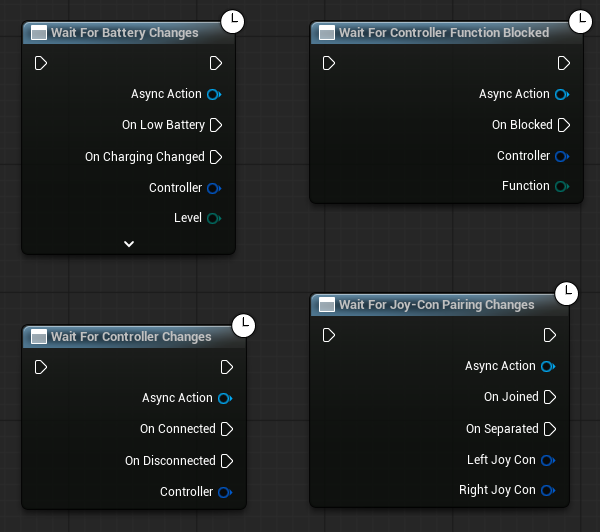
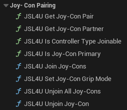
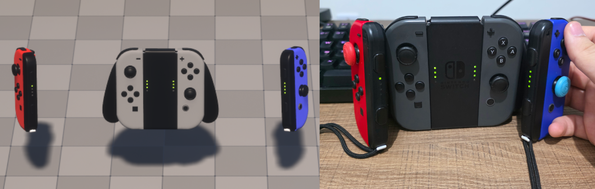

# JoyShockLibrary4Unreal

This is a fork of JibbSmart's [JoyShockLibrary](https://github.com/JibbSmart/JoyShockLibrary), modified to integrate with Unreal Engine's input system as a plug-in. This allows your Unreal Engine games to support DualShock 4, DualSense (including Edge), Switch Pro, Joy-Con and Switch 2 Pro controllers natively, and use some of their exclusive features such as gyro and touchpad. Switch 2 controllers — the
Pro Controller 2 and both Joy-Con 2 — connect over Bluetooth without being paired in Windows first.

**It fills the gaps rather than replacing Unreal's input.** Anything a standard gamepad can do — buttons, sticks, triggers, rumble, motion — reaches your game through Unreal's own input system, as the same keys and the same nodes an Xbox pad already uses. The `JSL4U*` nodes exist only for what Unreal and Windows have no concept of: gyro calibration, the light bar, joining two Joy-Cons into one player, assigning a controller to a player. So write your game against the engine's APIs and it supports every gamepad, and reach for a `JSL4U*` node when you want something only these controllers can do.

## Contents

**Getting started**
- [Hardware support](#hardware-support)
- [Installation](#installation)
- [Demo level](#demo-level)
- [How much of this do I have to set up?](#how-much-of-this-do-i-have-to-set-up)

**Features**
- [Input events](#input-events)
- [Reacting to controllers](#reacting-to-controllers)
- [Controller assignment and local multiplayer](#controller-assignment-and-local-multiplayer)
- [Combining Joy-Cons into one player](#combining-joy-cons-into-one-player)
- [Motion and gyro](#motion-and-gyro)
- [Rumble](#rumble)
- [Battery](#battery)
- [Lights and player indicators](#lights-and-player-indicators)
- [Conflicts with other applications](#conflicts-with-other-applications)
- [Nintendo Switch 2 Pro Controller](#nintendo-switch-2-pro-controller)
- [Nintendo Switch 2 Joy-Con](#nintendo-switch-2-joy-con)

**Reference**
- [Blueprint nodes](#blueprint-nodes)
- [Diagnostics and troubleshooting](#diagnostics-and-troubleshooting)
- [Source layout](#source-layout)
- [Questions](#questions)
- [Planned future updates](#planned-future-updates)
- [Credits](#credits)

## Hardware support

The current Unreal Engine 5.8 overhaul has been exercised with the hardware below. "Needs a regression
test" means the implementation is present and was working before the overhaul, not that the controller is
known to be broken. "Untested" means no unit has been available.

| Controller | Current validation |
| --- | --- |
| Nintendo Switch Joy-Con | Gameplay input, solo-horizontal and joined presentation, motion, pairing/separation, player LEDs, battery and multiple simultaneous controllers tested. |
| Nintendo Switch 2 Joy-Con | Implemented over Bluetooth (they never appear over USB), but **not yet confirmed on hardware** — no unit has been available here. Buttons, the single stick with its calibration, motion, rumble, player LEDs and joining into a pair are all in place; the sensor axis signs for a detached half are carried over from the Switch 1 Joy-Cons rather than measured. |
| Nintendo Switch Pro Controller | USB/Bluetooth input, motion, player LEDs and HD rumble are implemented, but untested since the overhaul. |
| Nintendo Switch 2 Pro Controller | USB gameplay input, calibrated sticks, motion and player LEDs tested. HD rumble with amplitude, the Bluetooth transport, battery reporting and the extra sensors (magnetometer, mouse, temperature) are implemented but not yet confirmed on hardware. |
| DualShock 4 | Bluetooth and USB gameplay input, stick conventions, motion, battery reporting and cable/Bluetooth transport switching tested. Battery percentages were checked against DS4Windows. Rumble could not be validated because the available controller's rumble hardware is broken. |
| DualSense / DualSense Edge | USB/Bluetooth input, motion, touchpad, light, player indicators and rumble are implemented, but need a regression test after the overhaul. Battery report offsets are unverified. |
| Xbox / other XInput pads | Handled entirely by Unreal, not by this plugin. The plugin takes their player slots into account so a JoyShock controller lands where a second Xbox pad would, and **Wait For Any Controller Changes** reports them alongside ours. Mixing them works; player numbering when a *wireless* Xbox pad is in the mix is still under investigation (see below). |

## Installation
- Download or clone the JoyShockLibrary4Unreal repo from this GitHub page and add it to your game's Plugins folder. The path to the Content folder should look like this: `<project>/Plugins/JoyShockLibrary4Unreal/Content`.
- Make sure that JoyShockLibrary4Unreal is enabled in your project's .uproject file or Plug-in settings.
- On Windows, no other plug-in is needed (hidapi is bundled). On other platforms, the plug-in falls back to microdee's [HIDUE](https://github.com/microdee/HIDUE) plugin for HID communication, so add it to your project as well.

## Demo level

There's a demo level called LV_JoyShockDemo in the Content folder! You can find it in your Content Browser, as long as you enable showing Plugin Content in your Content Browser settings:


Connect one or more controllers and press Play. The level is a small local-multiplayer example: every detected controller gets a native Unreal `LocalPlayer`, `PlayerController` and possessed Character. Move each Character with its controller's left stick. Both Standalone and the PIE viewport are supported.

The level's existing `CameraActor` has **Auto Activate For Player** set to **Player 0**. Consequently the
demo keeps its fixed overview camera whether zero or several controllers are connected; possessing a
Character does not make the view jump to that Pawn. This uses Unreal's normal automatic camera management
instead of a `Set View Target with Blend` graph in the PlayerController.

The example deliberately uses standard engine responsibilities:

- `BP_JoyShockInitializer` is a lightweight Actor. On `BeginPlay` it places one **Wait For Controller Changes** node and one **Wait For Joy-Con Pairing Changes** node. Both feed the same idempotent function, which calls **Ensure Local Player For Controller**, adds the demo Mapping Context, and spawns and possesses a Character only when that player does not already have one. Replayed connections, reconnections and Joy-Con separations therefore all converge on the same code path without ever producing duplicate Pawns.
- `BP_JoyShockGameMode` owns only the `DefaultPawnClass` and `PlayerControllerClass`; its old manual player-management graph was removed. The level contains separate `PlayerStart` actors.
- `BP_JoyShockPlayerController` is intentionally empty. It demonstrates that controller routing, possession and Enhanced Input do not require a second input implementation in the controller Blueprint.
- `BP_JoyShockCharacter` contains only gameplay input and a one-tick-delayed **Set Focus to Game Viewport** after possession, which also makes newly created Slate users work in the PIE viewport.





The sensor diagnostics remain available as a companion to the multiplayer example. `BP_JoyShockControllerMirror` is a digital representation of the physical controller: it follows the controller's measured orientation so motion and coordinate conventions can be checked visually. `WBP_JoyShockHUD` and its supporting widgets display numeric motion/controller state and expose calibration controls. They consume the direct-device `JSL4U*` API because those measurements have no Xbox/Enhanced Input equivalent; they are not a replacement input path for buttons, sticks or gameplay.

The Mirror and HUD are deliberately not responsible for controller discovery, Local Player creation, possession or Mapping Context setup. The Initializer owns that lifecycle, so a project can remove the visual diagnostics without changing gameplay routing.

The demo automatically spawns one Mirror per physical connection and passes the complete
`FJSL4UControllerInfo` into its Expose-on-Spawn `Controller` property. The Initializer keeps a
`ConnectionId → BP_JoyShockControllerMirror` map; disconnecting destroys only that connection's actor.
`ConnectionId` rather than `PlayerIndex` is intentional: joined Joy-Con halves share a PlayerIndex but
remain two physical motion sensors and therefore two Mirrors. No Mirror is placed manually in the level.

The HUD is rebuilt only when the connected set changes, then receives the current ConnectionId-to-Mirror map;
its sensor values continue updating normally between those rare changes. The Mirror never enumerates
controllers or creates Local Players. `FJSL4UControllerInfo` also
exposes capability flags (`Has RGB Light`, `Has Player Indicator`, `Has Motion Sensors`, `Has Touchpad`,
`Has Rumble`) so diagnostic widgets can enable their controls without hard-coding controller-type switches.

## How much of this do I have to set up?

Three levels, and most projects only ever need the first.

**1. Nothing.** Buttons, sticks, triggers, the touchpad, rumble and motion all arrive through Unreal's own input system, as the same keys an Xbox pad produces. Install the plugin and a project already built for gamepads supports DualShock 4, DualSense, Joy-Cons and Pro Controllers — existing Input Mapping Contexts, `Play Force Feedback Effect` and everything else keep working untouched. The only thing you bind by hand is what has no Xbox equivalent (motion, and the extra buttons listed below), and even then you are binding *engine* keys, not plugin keys.

**2. Reacting to controllers coming and going.** Only needed for a controller-assignment screen, per-controller UI, or local multiplayer. Place a **Wait For Controller Changes** node and handle its `On Connected` pin; see [Reacting to controllers](#reacting-to-controllers) for why this is a single node rather than a binding.

**3. Local multiplayer.** For each `Controller` delivered by `On Connected`, call **Ensure Local Player For Controller** with `bCreateIfMissing` enabled. It reuses player 0 for the first controller, creates only the missing local players through Unreal's native `FPlatformUserId` API, repairs any mapper reassignment caused by player creation, and returns the correctly typed **Player Controller** plus its local-player index.

A typical Blueprint flow is:

`BeginPlay → Wait For Controller Changes → (On Connected) → Ensure Local Player For Controller → Restart Player`

Set the GameMode's `DefaultPawnClass` and place enough `PlayerStart` actors for the maximum number of local players. **Restart Player** then chooses a start, spawns the default Pawn and possesses it through Unreal's normal player lifecycle. Manual **Spawn Actor** + **Possess** is still valid when a game needs custom spawn rules, but it is not required for the common case.

Unreal limits a `UGameViewportClient` to four Local Players by default, even when splitscreen rendering is disabled. A game that needs more must raise the standard engine setting in its project `Config/DefaultEngine.ini` and provide the same number of `PlayerStart` actors:

```ini
[/Script/Engine.GameViewportClient]
MaxSplitscreenPlayers=6
```

The demo project used for the six-controller test is configured this way; the plugin does not change a project's player limit automatically.

Mapping contexts belong to the Local Player. The cleanest reusable place to add one is the custom PlayerController's `BeginPlay`:

`Self → Get Enhanced Input Local Player Subsystem → Add Mapping Context`

A standalone Joy-Con is presented in Nintendo's solo-horizontal grip: its stick is rotated into the
physical horizontal orientation and exposed as Unreal's standard left stick; its four front buttons become
positional face buttons; SL/SR become the standard left/right shoulders; and the inaccessible outer
L/ZL or R/ZR buttons do not generate gameplay input.

**Motion is rotated with them.** A Joy-Con held sideways is the same hardware turned a quarter turn about
the axis out of its face, and its IMU does not know that: without correction, pointing the far end of a
sideways Joy-Con up arrives as *roll*, and the pitch a game reads never moves. The plugin takes that quarter turn out of orientation,
gravity, acceleration and local-space gyro, so `Pitch` means pitch and `Yaw` means yaw in either grip —
through the direct getters and through Enhanced Input's motion keys alike, which apply the same rotation.
World- and player-space gyro are left alone: those are already resolved against gravity and so are
grip-independent by construction. Joining two halves returns both to the vertical presentation and the
rotation disappears with it.

There is one place this shows: a mesh driven straight from `Get Motion State` draws a sideways Joy-Con
upright, because upright is the pose its input is being reported in. That is deliberate — the reading
describes how the controller is being *played*, not how it is lying — and it is the same answer for every
controller, so nothing in a project needs a Joy-Con special case. When a left and right half are joined they return to
vertical presentation, with the left half supplying Unreal's left stick and the right half its right stick.
Direct `JSL4U` state getters retain the native hardware fields; only engine-facing gamepad keys are adapted.
In particular, the Joy-Con R's native inverted vertical stick axis is normalised before its horizontal or
joined presentation, and DualShock 4 right-stick Y receives its engine-facing correction without changing
the direct getter. Shared Enhanced Input modifiers such as **To World Space** therefore receive the same
local X/Y convention from Joy-Cons, DualShock/DualSense and Pro Controllers; no per-device modifier is
needed in the Mapping Context.
Therefore a normal movement Mapping Context should bind only `Gamepad Left 2D` — do not also bind
`Gamepad Right 2D` to movement, because that would make a full controller's camera stick and right-stick
drift move the Pawn.

If you instead do this from a Pawn's **Event Possessed**, pass `New Controller` straight into
**JSL4U Get Controllers Assigned To Player**, which accepts the generic `Controller` type. Do not use
**Get Player Controller 0** there: that always addresses player 0, including when the Pawn belongs to
another Local Player.

`Ensure Local Player For Controller` defaults `bCreateIfMissing` to true and is safe to call again. Guard any downstream game logic separately: for a standard GameMode, checking whether the returned PlayerController already possesses the expected Pawn is enough; for per-connection actors or UI, keep a `ConnectionId → Object` map. Also note that `bWasCreated` is **false for player 0**, because Unreal created that Local Player before `BeginPlay`; it does not mean that player 0 already has your gameplay Pawn.

> **Turn off "Skip Assigning Gamepad to Player 1" before you do.** It lives in *Project Settings → Maps & Modes → Local Multiplayer* and is **on by default**. While it is on, and only once a second local player exists, the engine shifts every gamepad's input to the *next* player — so the first controller starts driving player 2's pawn and the last controller drives a player that does not exist, silently. It is there for games where the keyboard is player 1 and gamepads start at player 2; it works against you otherwise.
>
> This one is worth knowing about because it is almost impossible to diagnose from the symptom. Everything you can inspect looks right — the plugin reports the correct player index, the platform input device mapper agrees with it, and each player controller possesses the pawn you expect. The redirect happens inside `UGameViewportClient::RemapControllerInput`, after all of that, so nothing upstream shows a discrepancy. The giveaway is that a single player works perfectly and the assignment only scrambles the moment the second player is created.

### Local multiplayer in the PIE viewport

PIE keeps Slate focus separately for every local user. After creating a second player, that user's focus can remain on the editor `SWindow` instead of the PIE `SViewport`; Slate then discards that user's input before it ever reaches the game viewport. Standalone and packaged games do not normally have this editor-window artifact.

For a playable PIE viewport, call Unreal's standard **Set Focus to Game Viewport** node after the local players, possession, and mapping contexts have been set up. That node focuses the game viewport for all Slate users. Call it again when closing an in-game menu if that menu intentionally moved focus. The plugin does not force focus automatically, because doing so would break legitimate UI input modes.

While testing in the editor, you probably also want this in the console:

```
Slate.EnableGamepadEditorNavigation false
```

It is **on** by default, and it lets a gamepad move the editor's own focus around — so a controller you are testing with is also tabbing through panels behind the viewport, and a stick flick can land somewhere you did not intend. With two controllers connected it is worse, because both are doing it. The setting is the editor's, not this plugin's, and it does not affect a packaged game.

## Input events

For inputs that have an XInput equivalent (e.g. face buttons, triggers and sticks), simply adding JoyShockLibrary4Unreal to your project and enabling it will make Unreal recognize those inputs automatically for any compatible controller, with no code changes required.

For buttons that are exclusive to JoyShock inputs, new input events have been added:



The Switch 2 Pro Controller's exclusive buttons also have their own input events: **JoyShock C Button (Switch 2)**, **JoyShock Grip Left GL (Switch 2)** and **JoyShock Grip Right GR (Switch 2)**.

### Touchpad

The DualShock 4 and DualSense touchpad is exposed as **gamepad axes**, not as screen touches, so Enhanced
Input binds it exactly like a thumbstick:

| Key | Type |
| --- | --- |
| **JoyShock TouchPad 1 2D-Axis** | Axis2D — one finger's position in a single Vector2D |
| **JoyShock TouchPad 1 X-Axis** / **Y-Axis** | the components, if you want them separately |
| **JoyShock TouchPad 1 Touched** | button — down while a finger is on the pad |
| **JoyShock TouchPad 2 …** | the same four for the second finger |
| **JoyShock Capture / TouchPad Click** | the physical click, which is a separate button on the hardware |

Values are centred like a stick: `(0, 0)` is the middle of the pad, X runs left to right and Y runs bottom
to top, matching the sticks so a shared mapping (**To World Space** included) behaves the same on both. A
finger that is not down reads `(0, 0)`, which is why **Touched** exists — a corner-relative `0..1` range
could not tell "no finger" from "finger at the top-left corner".

Unreal's built-in **Touch 1 … Touch 10** keys are *not* the ones to use here, even though they are the
first place most people look. Those are touchscreen keys, fed by Slate's pointer pipeline, and a
controller touchpad has no screen position to give them; worse, a synthesised pointer press moves that
player's Slate focus to whatever widget it lands on, which takes their controller's input away from the
game viewport entirely. A touchpad belongs to one player's gamepad, so it is registered as one.

For games that genuinely want the pad driving Slate touch, `JoyShock.Touchpad.EmulateScreenTouch 1`
restores that behaviour. It is off by default, for the reason above.

### Native input-device metadata

Every connection is registered with Unreal's `FInputDeviceRegistry`, and the plugin supplies the same `Config/Input.ini` hardware metadata pattern used by the engine's XInput and WinDualShock plugins. `UInputDeviceSubsystem` therefore sees these as standard **Gamepad** devices with stable identifiers:

- `DualShock4`, `DualSense`
- `JoyConLeft`, `JoyConRight`
- `SwitchProController`, `Switch2ProController`
- `JoyShockGamepad` as the unknown-device fallback

The identifier describes the model; `InputDeviceId` describes one physical connection. Do not parse the display name to identify hardware, and do not persist `InputDeviceId` or `ConnectionId` between game runs.

## Reacting to controllers


Controllers finish enumerating on a background thread, at a moment nothing in the game controls: in the
editor they are usually ready before the level loads, in a packaged game they usually are not, and a
Bluetooth controller may arrive minutes in. Code that only handles "already connected" works on the
machine it was written on and nowhere else.

The **Wait For…** nodes remove that distinction. Each is a single latent node whose event pins carry their
payload as ordinary data pins — no Create Event, no Bind Event, no matching custom-event signatures:

- **Wait For Controller Changes** — `On Connected` fires immediately for every controller already
  connected and then for each new one, so there is no window in which a controller can be missed;
  `On Disconnected` reports the last known identity and whether reports simply stopped.
- **Wait For Any Controller Changes** — the same two pins, but for **every controller Unreal accepts**,
  including Xbox pads and everything else arriving through XInput. Use this one to decide when a *player*
  joins or leaves, and the JSL4U-only node above when you specifically need gyro, touchpad, lights or HD
  rumble. Both report the same `FJSL4UControllerInfo`; `bIsJoyShockController` says which kind arrived, and
  a controller the plugin does not drive reports the capability flags of its own hardware -- false for the
  gyro it does not have, true for the rumble it does. You rarely need to ask which kind arrived: every
  node takes the payload's `ConnectionId`, whichever kind it is. Keyboard and mouse are not reported: they share
  one device that is connected from the first frame, so announcing it would spawn a player before anyone
  touched anything.
- **Wait For Joy-Con Pairing Changes** — `On Joined` / `On Separated`, with both halves' identities
  already carrying their new grip mode, join partner and player assignment. Pairing actions are not
  replayed, because they are actions rather than persistent state; read **JSL4U Get Connected Controllers**
  when initial setup also needs the current pairing.
- **Wait For Battery Changes** — `On Low Battery` and `On Charging Changed`. See [Battery](#battery).
- **Wait For Controller Function Blocked** — see [Conflicts with other applications](#conflicts-with-other-applications).

Because `On Connected` already replays, do **not** add a separate `For Each` over
**JSL4U Get Connected Controllers** alongside it; doing both processes every existing controller twice.

Each node's `Async Action` output accepts **Cancel**, which is how a widget stops listening when it is
removed. `Remove From Parent` does not unbind anything on its own, so a widget that keeps listening after
being removed will keep running its handler against a half-dismantled state.

The same events are also available as assignable delegates on the **JoyShock Subsystem**, for C++ and for
Blueprints that prefer that style. If you use those directly, get the subsystem from a `BeginPlay` — not
from a Game Instance's `Init`, because subsystems are created at the very end of `Init` and the events
would silently never fire.

`FJSL4UControllerInfo` includes two different identities:

- `ConnectionId` names the controller. It is the only address the plugin's nodes take, it is not reused during the run, and it exists for every controller Unreal accepts -- positive for one this plugin drives, negative for one it does not. Use it as the key of maps that track spawned Pawns or handled connections.
- `InputDeviceId` and `PlatformUserId` are Unreal's native identities, exposed as integers for Blueprint. `HardwareDeviceIdentifier` is the stable model name registered with the engine.

### One address, honest answers

Every per-controller node takes a `ConnectionId` and accepts one for **any** controller, including the Xbox pads this plugin does not drive. A game does not branch on whose controller it is holding; it asks the controller for what it wants, and what comes back is the truth about that hardware:

- **Readings** — `Get IMU State`, `Get Motion State`, `Get Touch State` and friends return zeroes for hardware that has no such sensor. Check `Has Motion Sensors` / `Has Touchpad` on the controller info before believing (or offering) a reading of zero.
- **Rumble** — works on every pad. For one of ours the plugin writes the motors over HID; for a foreign pad it routes through Unreal's own force-feedback channels. One caveat there: the engine rewrites those channels every frame for a pad that belongs to a player, so a direct value set on an **assigned** foreign pad survives about a frame. On an unassigned one — the assignment screen, "buzz this pad so you know which it is" — it stands. For rumble during play, on any pad, use Force Feedback.
- **Everything else** (gyro calibration, light colour, player indicator, HOME light) does nothing on hardware that lacks it, and logs one warning naming the node and the connection. One warning per controller per node, not one per call, so a node sitting in a Tick cannot bury the log.

A stored `ConnectionId` whose controller has been unplugged resolves to nothing: the call fails or does nothing rather than landing on whichever controller connected next. That is the whole reason the nodes take this id and not the library's own handle, which *is* reused.

## Controller assignment and local multiplayer

Player slots are **stable**: a controller keeps its slot for as long as it stays connected, and a disconnect leaves that slot as a hole rather than shifting the others down — so if the player 1 controller drops mid-match, players 2 and 3 stay on their own characters instead of shuffling. The hole is reused by the next controller to connect. 4 solo-horizontal Joy-Cons = 4 players; two joined vertical pairs = 2 players. Joins dissolve automatically if one of the Joy-Cons disconnects.

Slots already taken by an **XInput pad** are skipped, so these controllers land where a second Xbox pad would have. Plug in an Xbox controller and a DualShock 4 and you get player 1 and player 2, the same as plugging in two Xbox controllers — a game does not need one assignment scheme for XInput and another for this plugin. (The flip side of matching XInput is that you inherit its behaviour: in a single-player game the second controller drives a player that does not exist, exactly as a second Xbox pad would.)

Slots otherwise follow the order controllers were switched on, and a controller that connected second stays on slot 1 even once it is the only one left — which in a single-player game means its input goes to a player that does not exist. Use **JSL4U Assign Controller To Player Index** to decide this yourself rather than inheriting connection order; it is the only thing that overrides it.

**Slots may be shared, and that is how any set of controllers drives one player.** Assign two, three or four controllers to the same slot and they all drive that player — a joined Joy-Con pair is simply the case the plugin performs for you, complete with the vertical stick/button split. Nothing is limited to Joy-Cons: a DualSense and a Pro Controller on one slot both move the same Pawn.

### More than four players

Unreal caps the number of local players at **4** by default, and a fifth controller silently gets no
player: it connects, it is reported here, it is given player slot 4, and `Create Player` refuses it. The
number lives on the game viewport under the name `MaxSplitscreenPlayers`, which is a misnomer worth
knowing about — it caps `Create Player` whether or not the screen is ever split, and it is still enforced
with **Set Force Disable Splitscreen** on. Splitscreen stops at four because four is as many views as fit
on a television; that is a rendering limit and says nothing about how many people are playing.

Call **JSL4U Set Max Local Players** from `BeginPlay`, before creating any player, to raise it. Doing it
there keeps a decision that belongs to your game in your game, rather than in a `DefaultEngine.ini` entry
under the wrong name where nobody reading your player-spawning code will find it. **JSL4U Get Max Local
Players** reads it back.

Assignment nodes are under **JoyShock Library | Controller Assignment**:

- **JSL4U Set Max Local Players / JSL4U Get Max Local Players** — the ceiling on `Create Player`, above.
- Reading the slot back has no node of its own: every controller info already carries **Player Index**, so breaking the struct any node hands you — or **JSL4U Get Controller Info** — answers it, for XInput pads as readily as for ours.
- **JSL4U Assign Controller To Player Index (Controller, Player Index)** — puts a controller on a chosen player slot. Pass -1 to hand it back to automatic assignment. Works for XInput pads too.
- **JSL4U Assign Controller To Player (Controller, Player Controller)** — the same thing addressed by **PlayerController** instead of slot number.
- **JSL4U Get Controllers Assigned To Player** — every controller feeding a player, XInput pads included, taking the generic `Controller` type so a Pawn's `Possessed` event plugs straight in. Two entries for a joined pair.
- **Ensure Local Player For Controller** (on the JoyShock Subsystem) — the high-level local-multiplayer path: reuse or create the correct Local Player from the controller's native Platform User, return its PlayerController, and reconcile the engine device mapper.

## Combining Joy-Cons into one player

A left+right Joy-Con pair can act as a single vertical controller for one player. Grip changes follow the
Switch convention globally:

- A Joy-Con connected by itself starts as a solo-horizontal controller.
- Press **SL + SR** on either half of a joined pair to separate both halves; each becomes horizontal.
- On two separated halves, hold **L or ZL** on the left and **R or ZR** on the right at the same time to
  join them as one vertical controller. For example, **ZL + ZR** is sufficient. The outer buttons are
  registration input and are suppressed until released, so the join does not also fire gameplay actions.
- When several left/right halves perform the chord in the same frame, device-id order pairs them
  deterministically.

Pairing nodes are under **JoyShock Library | Joy-Con Pairing**:



- **JSL4U Get Joy-Con Pair** — given either half, returns whether it is a pair plus both halves' identities. `Primary` names the same half no matter which one was asked, which is what lets an actor act  on a pair   without first working out which half it is attached to.
- **JSL4U Get Joy-Con Partner** — whether this half is joined right now, and to which Connection Id.
- **JSL4U Is Controller Type Joinable** — whether a controller type can be joined into a pair (currently the left and right Joy-Cons). `JSL4U Join Joy-Cons` validates with this same function.
- **JSL4U Is Joy-Con Primary** — whether this device is the one representing its logical controller. True
  for any standalone controller of any type, and for exactly one half of a joined pair.
- **JSL4U Join Joy-Cons (A, B)** — joins a left and a right Joy-Con so they feed a single player and sets both vertical (left half = left stick and its buttons, right half = right stick and its buttons).
- **JSL4U Set Joy-Con Grip Mode** — explicit per-device override. Standalone defaults to Horizontal; set
  Vertical for exceptional games that intentionally use one upright half, such as Just Dance. Setting
  Horizontal on a joined half separates the pair.
 - **JSL4U Unjoin Joy-Con / JSL4U Unjoin All Joy-Cons** — dissolve joins and return each half to horizontal presentation.


`Primary` identifies a *device*, not a *side*: which half leads depends on connection order, so a pair's
primary may be the right Joy-Con. Read `Controller Type` on the returned infos when something has to land
on a specific physical half.

## Motion and gyro

Motion is reported through **Unreal's own motion input**, the same path a phone's gyro and accelerometer use. That means `Tilt`, `RotationRate`, `Gravity` and `Acceleration` can be bound in Enhanced Input like any other axis, with no plugin-specific Blueprint code — `RotationRate` is the one you want for gyro aiming. The direct getters (`JSL4U Get IMU State`, `JSL4U Get Motion State`) are still there and use the same axes, so you can mix the two freely.

`JSL4U Get Motion State` returns a gravity-corrected orientation, so pitch and roll are absolute — they
stay anchored to real-world down rather than accumulating error. Yaw still drifts, as it must without a
magnetic or visual reference, which is what makes a "recentre" action worth offering in a game that maps
absolute orientation to anything.

**JSL4U Set Gyro Space** chooses the frame of reference gyro input is reported in — *Local Space* (raw,
relative to the controller), *World Space* (corrected by the measured gravity direction, so yaw is always
around the real vertical), or *Player Space* (a blend that is as adaptive as world space and as robust as
local space). Player Space is the usual choice for gyro aiming, and is worth exposing as a player
preference in a game that aims with gyro.

### Gyro calibration

A gyroscope reports a small non-zero rotation even when perfectly still, so a controller left alone slowly drifts. Calibrating measures that offset while the controller is still and subtracts it. Nodes live under **JoyShock Library | Gyro Calibration**.

**Most games need none of them.** Every controller starts in *Automatic*, which works out for itself when
the controller is being held still and keeps the offset current. Calibration is handled unless you decide
otherwise, and **JSL4U Set Gyro Calibration Mode** exists to opt out with *Manual*.

The rest exist for games that want an explicit calibration screen:

- **JSL4U Start / Stop Manual Gyro Calibration** — gather samples for the drift offset while the controller sits still, then stop. Only meaningful in Manual mode.
- **JSL4U Reset Gyro Calibration** — throw the current offset away and start over. This is the one manual node worth exposing to players even in Automatic mode, because an offset measured while the controller was moving leaves the gyro worse off than no calibration at all, and this is the way out. It suits a "Recalibrate gyro" button.
- **JSL4U Get Gyro Calibration Status** — what drives a calibration screen's prompts and progress.
- **JSL4U Get / Set Gyro Calibration Offset** — read the offset as a **Vector** to save it per controller and restore it next session, so a returning player doesn't have to calibrate again. These use the same axes as *JSL4U Get IMU State*.

The status struct's three fields are easy to misread, so they are named after the mechanism they belong
to. **Auto Calibration Confidence** only ever climbs: it is a high-water mark meaning "this controller was
measured well at some point", not a live reading. **Auto Calibration Sampling Now** is the automatic
calibrator's own gate, true only while it is taking samples — it is *not* a general "the controller is
still" reading, and a controller lying untouched on a desk commonly reports false once the calibrator has
settled. **Manual Calibration Running** is the manual counterpart, true between Start and Stop. For a
genuine "is it moving right now" readout, compare the length of the gyro vector from *Get IMU State*
against a small threshold.

## Rumble

These controllers work with **Unreal's own force feedback**. `Play Force Feedback Effect`, `Client Play Force Feedback` and Enhanced Input's force feedback effects drive a DualShock 4, DualSense, Joy-Con or Pro Controller exactly as they drive an Xbox pad — so authored effects with curves, falloff and looping work, and you get one code path for every gamepad. Nothing to enable. Effects are aimed at a *player*, so both halves of a joined Joy-Con pair rumble together.

The channels map the way Unreal's XInput interface reads them: `LeftLarge` drives the heavy/low-frequency motor and `RightSmall` the light/high-frequency one, so an effect authored against a standard gamepad comes out the same here.

For direct control there is `JSL4U Set Controller Rumble (ConnectionId, SmallRumble, BigRumble)`, 0-1 per motor (call it with `(0, 0)` to stop). Both routes reach the same maximum — force feedback is clamped to 0-1 and 1 arrives as full strength — so an effect that feels weak is a weak curve in the asset rather than a limit here. (`Force Feedback Scale` and `b Force Feedback Enabled` on the PlayerController also apply.)

Use the direct node for the three things force feedback cannot do, all of them because it is aimed at a *player* rather than a controller: rumbling **one specific controller** (a joined Joy-Con pair is one player but two controllers, so only this can buzz just the left one); rumbling a controller **not assigned to any player**, which is what a controller-assignment screen needs for "press here and feel which controller this is" before players exist; and holding a constant intensity without authoring a looping asset.

The two are independent — a force feedback effect plays over a rumble you set directly, and neither cancels the other. Each motor runs at whichever of the two is stronger.

Per controller family:

- **DualShock 4 / DualSense**: small and big motor intensities.
- **Joy-Cons / Pro Controller (Switch 1)**: full HD-rumble amplitude control — `BigRumble` drives the low-frequency component (heavy shake), `SmallRumble` the high-frequency one (fine buzz). The vibration is sustained automatically until you set `(0, 0)`.
- **Switch 2 Pro Controller**: full HD-rumble amplitude control, the same as the Switch 1 — `BigRumble` drives the low-frequency component, `SmallRumble` the high-frequency one, and the vibration is sustained until you set `(0, 0)`. Each packet carries about 15ms of waveform, so the plug-in feeds the controller continuously while a rumble is held. Works over both USB and Bluetooth.
- Note: close Steam when using the Switch 2 Pro Controller with Unreal — Steam holds the controller's USB command interface exclusively, which blocks the plugin's init and rumble (the plugin logs a warning and re-acquires the interface automatically once Steam is closed). Rumble also has an HID fallback that works without that interface, and Bluetooth is unaffected either way.

## Battery

`Controller Info` reports **Battery Level** and **Is Charging** for Joy-Cons, Switch Pro, DualShock 4 and
DualSense, plus **Battery Percent** where the hardware measures one. **Wait For Battery Changes** turns
those into events: `On Low Battery` fires once per episode and re-arms when the controller is charged or
plugged in, and `On Charging Changed` reports the cable or dock going in and out.

Battery Level is a coarse enum — `Empty`, `Critical`, `Low`, `Medium`, `Full` — deliberately, not a
percentage: a Switch 1 controller reports five states, so a percentage there would be invented precision,
and a game written against a percentage misbehaves on exactly the controllers that cannot supply one.
The PlayStation controllers and the Switch 2 fill Battery Percent; it is `-1` elsewhere and is meant for
display, not for decisions. `Unknown` means the controller does not report charge at all, and is never a
low battery.

A Switch 2 controller reports its battery as the cell's terminal **voltage** rather than as a charge, so
its percentage is interpolated across a lithium cell's usable span (3.0 V empty to 4.2 V full). That is a
straight line where the real discharge curve is not one, and voltage sags under load — a controller reads
lower mid-rumble than it does at rest. Drive a bar from it, not a number. The measured voltage itself is
available from **JSL4U Get Switch 2 Sensors** if you want the reading rather than the estimate.

## Lights and player indicators



**Player indicators follow Unreal assignment automatically.** Joy-Cons, Switch Pro and Switch 2 Pro
Controllers use Nintendo's distinct player patterns (including combination patterns for players 5-8),
and joined Joy-Con halves show the same player. DualSense uses its five native player patterns. Calling
**JSL4U Set Player Indicator** manually overrides the displayed one-based number until the next controller
assignment change.

Nintendo's blue HOME-button light is a notification light, not a player number. Controllers can retain
that light from firmware or a previous host, so JSL4U clears it on Joy-Con R and Switch Pro after their
input stream starts, using Nintendo's explicit zero-brightness pattern; assignment uses only the four green
player LEDs. A game that wants that light as a feedback channel can take it with **JSL4U Set Home Light**,
after which the plugin stops clearing it on that controller for the rest of the connection. Before the game
or editor process opens, the plugin is not running and cannot change a controller's retained/default LED
state. Switch 2 Pro initialization likewise preserves its current indicator until Unreal assigns its actual
Local Player, instead of briefly turning every player LED off.

DualShock 4 has no numeric player LEDs, so **Set Player Indicator** intentionally does nothing on it. To
test its RGB light bar, call **JSL4U Set Light Color** with its `ConnectionId` and an obvious color such as
magenta. The light bar and rumble are separate fields in the same output report, so a broken rumble motor
does not by itself prevent the color test.

## Conflicts with other applications

Steam Input, DS4Windows and similar tools can hold a controller's output path while input keeps flowing,
so rumble or player LEDs stop working with nothing to explain why. **Wait For Controller Function Blocked**
fires when an output write is rejected while the controller is still delivering input, naming which
capability is affected: `Rumble`, `Player Indicator`, `Home Light` or `Motion Sensor`. It fires once per
function until that function works again, and only when the game actually uses it.

Only failures the OS reports are detectable this way. An application that swallows output without failing
the write cannot be distinguished from one that is not running.

## Nintendo Switch 2 Pro Controller

The Switch 2 Pro Controller is supported over **USB and Bluetooth** on Windows. Over USB, just plug it in — the plug-in initializes it through its WinUSB interface (the Switch 2 uses a new protocol that is not compatible with Switch 1 controllers), reads its factory stick calibration and colors, and parses all of its inputs:

- All buttons, including the new **C (GameChat)**, **GL** and **GR** buttons
- Both analog sticks, using the per-unit factory calibration
- Gyro and accelerometer, fully integrated with the motion API (`JSL4U Get Motion State`, `JSL4U Get And Clear Accumulated Gyro`, calibration, etc.)
- HD rumble with real amplitude on both actuators
- Player-indicator LEDs, kept in sync with the controller's assigned Unreal Local Player
- Multiple Switch 2 Pro Controllers at the same time

### Bluetooth

**Do not pair the controller in Windows' Bluetooth settings.** It would not help: the Switch 2 has no
Bluetooth HID profile, so Windows has nothing to pair it *as* and never makes it a gamepad. It is a plain
Bluetooth LE peripheral with a vendor GATT service, and the plug-in speaks to that service directly —
scanning for the controller itself, connecting, and reading its input from a GATT notification.

To connect a controller the first time, **hold its SYNC button** (the small button next to the USB port)
until the lights start moving. The plug-in finds it, connects, and pairs it to this PC. From then on
**pressing any button** is enough — the controller reconnects on its own.

Everything above works the same over Bluetooth as over USB: the same buttons, the same calibrated sticks,
motion, HD rumble and player LEDs. A controller that is connected by cable is left on the cable; the radio
link is only taken for a controller that is not already here on USB.

On connecting, the plug-in asks Windows for a 7.5 ms connection interval. That request is what decides the
polling rate — a Bluetooth LE peripheral may only speak once per interval, and the default Windows picks
for a link it was told nothing about is tens of milliseconds, which turns a controller with input ready
every frame into one heard from a handful of times a second. If the radio refuses the request the
controller still works, just with more latency, and a line is logged saying so.

### Nintendo Switch 2 Joy-Con

The Joy-Con 2 connect the same way, and only that way — they never appear over USB, because the console
charges them through the rails and a cable to a PC gives nothing. Hold SYNC on each half the first time;
after that a button press brings it back.

A detached half behaves like a Switch 1 Joy-Con: it is its own controller, reports as `Joy-Con 2 (L)` or
`Joy-Con 2 (R)`, starts out sideways, and joins into a single two-stick player with the same chords —
**L or ZL on the left half together with R or ZR on the right** to join, **SL+SR on either half** to
separate. The Blueprint pairing nodes treat both generations identically.

Each half also carries the sensors the Switch 2 controllers have and nothing else does — magnetometer,
temperature, and the optical mouse sensor in its underside — all on **JSL4U Get Switch 2 Sensors**.

The mouse sensor reports an **absolute** position that runs 0..65535 on both axes and rolls over, which is
about 80 cm of desk on a scale of roughly 12000 units per length of a Pro Controller. Subtracting one
reading from an earlier one therefore reports a jump of a full 65536 every time it wraps. Two ways not to
deal with that yourself:

- **JoyShock Mouse L / Mouse R 2D-Axis (Switch 2)** are Enhanced Input keys, bound exactly like a
  thumbstick. There are two because a joined pair really is two mice for one player — the console uses them
  that way, and one axis would let one hand cancel the other. A detached half feeds only its own side; bind
  both to the same Input Action if you want "whichever half is in use". The value is a delta in the
  sensor's own counts, like Unreal's Mouse X / Mouse Y, so scale it in the mapping context.
- **JSL4U Consume Switch 2 Mouse Delta** is the same movement as a Blueprint node, for a game not using
  Enhanced Input for it. It consumes what it reports, so call it from one place. It keeps its own tally, so
  using it does not take anything away from the axis keys.
- **Mouse Travel**, on the sensors struct, is the movement accumulated instead of wrapped. It only grows,
  so differences between reads are just differences, and every caller sees the same value.

`Mouse Distance` is what tells you the controller is being used as a mouse at all: about 3000 in the air,
falling from roughly 5 mm out, and 140–150 resting on a surface. `Mouse Roughness` reads the surface —
about 4600 in the air, 4380 on a mousepad, 2500 on a bare desk, 2000 on cloth.

**Tested on hardware once**, by a contributor with a pair, which found and fixed three faults. What is
still unverified is the Bluetooth init's reliability: a controller whose calibration read fails falls back
to a fixed stick range and reaches about two thirds of full deflection, which feels like a character that
walks slower than everyone else's. If you see that, the log says which read failed and at what address.

The transport is Windows-only and needs a machine with Bluetooth LE. It is built against the Windows SDK's
C++/WinRT headers; if the build machine has no Windows 10/11 SDK carrying those, the plug-in still builds
and logs that Switch 2 controllers will be USB-only.

The Switch 2 command endpoint is WinUSB-exclusive even though its HID input endpoint is visible to more
than one process. This matters for Unreal's multi-process Standalone mode: the parent editor and the
Standalone game can discover the same controller. JSL4U releases an idle WinUSB command lease after one
second; a process that initially lost the race retries calibrated initialization after the lease becomes
available. Thus the playing process still reads the controller's factory stick centres and can use rumble
and LEDs without requiring Steam — or the parent editor — to be closed.

## Blueprint nodes

The API is `JSL4U*` and nothing else. The original library's `Jsl*` layer — its raw integer enums, loose float outputs and synchronous device scan — is gone entirely, not merely hidden from Blueprint: half of it had no caller left, and the half that did was folded into the internal `…ForHandle` helpers the `JSL4U*` nodes call. A node takes a connection id; a helper takes a device handle; there is no third convention.

Current nodes are grouped by responsibility:

- **Events** — the latent **Wait For…** nodes.
- **Controllers** — discovery, connection checks and complete controller identity. **JSL4U Get Switch 2 Sensors** also lives here: the battery voltage, temperature, magnetometer and underside mouse sensor that only the Switch 2 controllers carry, along with **JSL4U Consume Switch 2 Mouse Delta**. Motion is *not* there — accelerometer and gyroscope come from the Motion nodes, which every controller answers.
- **Controller Assignment** and **Local Multiplayer** — controller-to-player routing and native Local Player creation.
- **Joy-Con Pairing** — joining and separating Joy-Cons, and resolving a pair from either half.
- **Input State**, **Motion** and **Touchpad** — direct state queries for features not already better handled by Enhanced Input. The touchpad is bindable in Enhanced Input too — see [Touchpad](#touchpad).
- **Gyro Calibration** — calibration mode, manual calibration, status and persistent offsets.
- **Output** — light color, player indicator, HOME light and direct-device rumble.
- **Diagnostics** — hardware resolution, poll interval and time since the last input report.

Node names and tooltips state units, invalid-result behavior and when Unreal's own Enhanced Input or Force Feedback should be preferred. Tooltips also say which node is the one most games need, and which exist only for less common cases. Search for `JSL4U` to list the complete callable API.

The old empty **Project Settings → Plugins → JoyShockLibrary4Unreal** page has been removed. It had no active setting and suggested configuration that the runtime never read; controller behavior is now either standard Unreal behavior or an explicit `JSL4U*` call.

JSL4U functions favour Unreal Engine's types and standards, so instead of returning three loose floats for an acceleration vector, they return an `FVector`. Vectors and quaternions use Unreal's left-handed, Z-up coordinate system rather than the original library's right-handed, Y-up axes.

## Diagnostics and troubleshooting

The temporary per-button dispatch and Slate-routing measurements used while developing the local
multiplayer example are not part of normal plugin output. For low-level HID troubleshooting,
`JoyShock.Debug.InputStalls 1` warns if a connected controller stops delivering reports for more than one
second and reports when delivery resumes. Set it back to `0` to disable it.

**Player numbers that skip.** A slot already held by a controller this plugin does not own is stepped
over, by design — that is what makes a JoyShock controller land where a second Xbox pad would. Verbose
logging (`Log LogJoyShockLibrary Verbose`) names the input device holding each slot that gets skipped,
which is what distinguishes "an XInput pad is legitimately on player 1" from "something claimed a slot and
never released it". **Wait For Any Controller Changes** answers the same question in-game: it reports every
controller Unreal knows about with the player index it landed on.

A single `Enabling IMU data...` line is expected while a controller is first initialized.

Bluetooth drops subcommands, and a lost one fails silently and permanently: the controller keeps streaming
buttons while its motion values stay at zero for the whole session. The Joy-Con handshake therefore waits
for the controller's acknowledgement of the IMU enable and the report-mode change, re-sending when it does
not arrive. Joy-Con firmware can also acknowledge the enable and still never start the sensor, so a stream
that stays motionless is repaired in place by toggling the IMU off and on — as a bare write, never a
subcommand exchange, because reading a reply from the polling thread would steal input reports. If both
fail, the plugin logs one warning and preserves the working button/stick stream rather than mutating it
further.

Configuration subcommands are otherwise never sent into an established Bluetooth stream. Re-asserting the
HOME light on a timer, for instance, caused right Joy-Cons to drop off Bluetooth after a few minutes, so
that light is cleared exactly once per connection.

Plugging a USB cable into a controller that is already paired over Bluetooth does not end the Bluetooth
link — it adds a second HID device. The plugin recognises both paths as one controller by its MAC address,
moves input onto the cable and back to the radio when it is pulled, and keeps the same connection id, player
slot and Pawn throughout, so neither event reaches the game as a connect or disconnect.

## Source layout

Nothing here is needed to *use* the plugin — this is for reading or changing it.

The source is in three layers, and the folder a file sits in tells you which one it belongs to. The rule
they follow is that dependencies point one way only: the hardware layer never knows about Unreal's input
system, and the Unreal layer never talks to a controller directly.

**`ThirdParty/hidapi/`** — the HID library, unmodified. Not ours.

**`Source/JoyShockLibrary4Unreal/JoyShockLibrary/`** — the hardware layer. Opens controllers, speaks each
family's protocol, and runs one polling thread per device. Descends from JibbSmart's original library,
though little of it is unchanged now.

| File | |
|---|---|
| `JoyShock.h` / `JoyShock.cpp` | One connected controller: construction, reading a report off whichever transport it is on, and the motion pipeline. Nothing family-specific |
| `JoyShock_Nintendo.cpp` | Switch 1 protocol — subcommands, SPI stick calibration, rumble, player and HOME lights |
| `JoyShock_Switch2.cpp` | Switch 2 protocol — the WinUSB command interface, the BLE GATT transport, its own rumble frames |
| `JoyShock_Sony.cpp` | DualShock 4 and DualSense — output reports, light bar, the Bluetooth CRC-32 |
| `Switch2Bluetooth.*` | The BLE scan and connection the Switch 2 needs, since Windows will not pair it as a HID device |
| `JoyShockPolling.cpp` | One controller's polling thread, and the output reports it is the sole writer of |
| `JoyShockLibrary.cpp` | The device registry: the maps of live devices, device-id allocation, and shutdown |
| `JoyShockInternal.h` | What those files share — the registry globals and the handle helpers |
| `InputHelpers.h` / `InputHelpers.cpp` | Decoding an input report into controller state, with one parser per family |
| `GamepadMotion.hpp` | JibbSmart's motion and calibration maths, used as-is |
| `tools.*` | Byte-fiddling helpers inherited from the original library |
| `JoyShockLibrary.h` | Now just the library's own entry points; kept so old includes still resolve |

**`Source/JoyShockLibrary4Unreal/Public/`** — what a game can see.

| File | |
|---|---|
| `JoyShockTypes.h` | The data: controller states, the enums a Blueprint branches on, button masks. The header everything else includes |
| `JoyShockBlueprintLibrary.h` | The `JSL4U*` nodes — the plugin's public face |
| `JoyShockInterface.h` | `FJoyShockInterface`, the `IInputDevice` Unreal polls each frame |
| `JoyShockSubsystem.h` | The game-instance subsystem carrying the connect/disconnect/pairing delegates |
| `JoyShockAsyncActions.h` | The latent **Wait For…** nodes |
| `JoyShockLibrary4Unreal.h` | The module itself |

**`Source/JoyShockLibrary4Unreal/Private/`** — how it is done.

| File | |
|---|---|
| `JoyShockBlueprintLibrary.cpp` | The nodes, implemented — mostly locked reads of state the polling thread produced |
| `JoyShockEnumeration.cpp` | Finding controllers and opening them, in three phases that exist to keep blocking HID I/O away from the lock the game thread takes |
| `JoyShockInterface.cpp` | Hardware state into Unreal input events |
| `JoyShockPlayerAssignment.cpp` | Which controller belongs to which player: slot allocation, joining and splitting Joy-Cons, grip transitions |
| `JoyShockInterfaceInternal.h` | The few predicates those two files share |
| `JoyShockSubsystem.cpp`, `JoyShockAsyncActions.cpp`, `JoyShockLibrary4Unreal.cpp` | The subsystem, the latent nodes and module startup |

### Where to change what

| If you want to… | Go to |
|---|---|
| Support a new controller model | `JoyShockEnumeration.cpp` to recognise it, a `JoyShock_*.cpp` for its protocol, `InputHelpers.cpp` for its report layout |
| Fix a misread button, stick or trigger | `InputHelpers.cpp` — the per-family parser |
| Change what a Blueprint node does | `Public/JoyShockBlueprintLibrary.h` for the signature, `Private/JoyShockBlueprintLibrary.cpp` for the body |
| Add a field to a controller's state | `Public/JoyShockTypes.h`, then whichever parser fills it |
| Change rumble or light behaviour | `JoyShockPolling.cpp` — the polling thread is the only writer of output reports |
| Change how players get their controllers | `JoyShockPlayerAssignment.cpp` |
| Fix a controller that connects twice, or not at all | `JoyShockEnumeration.cpp` |

### Things worth knowing before changing any of it

- **The polling thread is the sole writer of output reports.** The `JSL4USet*` nodes only store what the
  game asked for; the thread sends it. Writing from the game thread means a blocking HID write while
  holding the lock that same thread needs to parse every input packet.
- **`_connectedLock` is never held during blocking HID I/O.** hidapi's Windows write has no timeout, so a
  controller that never answers would hang the editor until the cable is pulled. This is why enumeration
  is split into phases.
- **A controller's identity is its MAC where one can be read, and its HID path otherwise.** That is what
  lets a controller keep its player slot across a reconnect, and what stops one controller reachable two
  ways from becoming two.
- **`UJoyShockLibrary` and the node names cannot be renamed.** Saved Blueprint graphs refer to them.

## Questions

### Which versions of Unreal Engine has this been tested with?
It has been used in Unreal Engine 5.4 and, more recently, 5.8 (where it uses the new `FInputDeviceRegistry` API that replaces the deprecated `FInputDeviceScope`). I expect it to work in other versions of Unreal, but if you find any issues, feel free to let me know.

### Why should I use this plug-in instead of Steam Input or DS4Windows?

They each have their different use cases. Steam Input and DS4Windows do a fantastic job translating non-Xbox controller inputs into XInput, and I love that they can add gyro aiming to games that wouldn't support them otherwise by assigning gyro to Mouse. However, if you're making a game with JoyShockLibrary4Unreal, your game can support those controllers and make use of their features natively, without players having to worry about running background apps or remapping inputs.

### Can I use the controller motion processors contained in this plugin with official PlayStation and Switch controller libraries?
No official Sony or Nintendo libraries were used in the development or testing of JoyShockLibrary4Unreal, so I'm unable to answer that. However, you are welcome to modify the plug-in as you see fit. The functions in GamepadMotion.hpp should help you process motion data regardless of how you got it.

## Planned future updates

### Plugin
- Amplitude-accurate rumble on the Switch 2 Pro Controller, so force feedback effects that fade in or out don't come out as a flat buzz on it. Needs its amplitude channel reverse-engineering over USB
- Charge-curve battery reporting for the Switch 2. The controller reports its cell voltage and nothing else, so the percentage is interpolated linearly between 3.0 V and 4.2 V — good enough for a bar, too coarse for a number, and it will read low under a heavy rumble

### Hardware still to be tested
These are implemented but unverified, purely because no unit has been available. Reports from anyone who
owns one are very welcome.

- **Nintendo Switch 2 Joy-Con, Bluetooth init reliability** — a first hardware session found the factory-data reads failing at connect, seemingly at random, on either half. The cause was the response channel taking the first notification to arrive as the answer, which for a memory read is often the acknowledgement rather than the data; that is fixed, and the reads now retry and log which address failed. What has not been re-tested is whether anything still fails after it. A controller whose calibration read fails is not dead — it falls back to a fixed stick range and reaches about two thirds of full deflection
- **Nintendo Switch Pro Controller (Switch 1)** — untested since the Unreal Engine 5.8 overhaul. Its right stick's Y axis was the one family never sign-normalised, which is now fixed in the parser and wants confirming on hardware
- **Xbox and other XInput pads** — mixing them with JoyShock controllers works, but a *wireless* Xbox pad appears to consume more than one player slot, so the next JoyShock controller lands a number further out than expected. A pad connected by cable does not do this. Unconfirmed; Verbose logging now names whatever is holding each skipped slot
- **DualSense battery reporting** — the report offsets come from public reverse-engineering rather than measurement, and are marked as unverified in the code. The DualShock 4 equivalents were checked against DS4Windows
- **DualSense touchpad Y range** — the DualSense normalises its touch coordinates with the DualShock 4's pad height, which the two do not share. If that is wrong, a finger at the bottom edge reads past 1.0 instead of reaching it. Easy to check with the demo's touchpad readout

### Demo level
- **Controller models still missing from the on-screen mirror.** Only the Joy-Con pair, the Joy-Con grip, the DualShock 4 and the DualSense are modelled; everything else falls back to whatever the mirror is given. The Joy-Con 2 borrow the Switch 1 Joy-Con models, which are the same shape. Needed: Nintendo Switch Pro Controller, Nintendo Switch 2 Pro Controller, and an Xbox pad for the controllers Unreal handles directly
- **A controller can arrive without its character responding.** Reported once with a Joy-Con 2: the mirror appears and the motion readouts work, but the pawn does not move. Stopping and re-playing fixes it, which is not an option in a packaged build. Not yet diagnosed; it is the demo's assignment path rather than the plug-in's, since the controller is visibly connected and reporting

## Credits
- A massive thanks to JibbSmart for creating the original JoyShockLibrary plug-in, and for answering the questions I sent to his Twitter DMs. For the full credits of the original JoyShockLibrary, check out his [JoyShockLibrary](https://github.com/JibbSmart/JoyShockLibrary) repo.
- microdee for the [HIDUE](https://github.com/microdee/HIDUE) Unreal plug-in, which JSL4U relies on for both USB and Bluetooth connections.
- Bundled DualSense 3D model created by [Saleem Akhtar](https://www.artstation.com/marketplace/p/zBM9R/ps5-duelsense-controller-3d-model-fbx).
- The Joy-Con, Joy-Con grip and DualShock 4 models used by the demo's controller mirror were modelled by [uayten](https://github.com/uayten) for this plugin.
- [uayten](https://github.com/uayten) for the 07/2026 overhaul: Unreal Engine 5.8 native input and local multiplayer; stable controller discovery, identity and player routing; Joy-Con horizontal play, joining/separation and player LEDs; total implementation of the Nintendo Switch 2 Pro Controller; battery reporting; cable/Bluetooth transport switching; the per-controller mirror, sensor HUD and demo workflow; consistent engine-facing stick axes; and the controller connection, freeze and shutdown-crash fixes.
